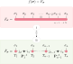

# tX

**tX** is a program for performing *tensor cross interpolation*, a numerical technique for constructing (hopefully) low-rank compressions of arbitrary functions, such that a given function $f(\boldsymbol{\sigma}) = F_{\boldsymbol{\sigma}}$, where $f:  \\{ \boldsymbol{\sigma} \\} \to \mathbb{R}$, yields the *approximation* $\tilde{F}_{\boldsymbol{\sigma}}$. Here, $\\{ \boldsymbol{\sigma} \\}$ is a set of discrete-index configurations, such that $\boldsymbol{\sigma} = (\sigma_1, \ldots, \sigma_n)$, where each $\sigma_k$ has some local dimension, $d$. Sampling a subset of all elements, we should obtain a matrix product state (**MPS**), which is amenable to a variety of fast tensor-network contraction operations. For example, one can quickly and cheaply evalate sums and integrals involving the original function.

### Dependencies

* [NumPy](https://numpy.org/)
* [SciPy](https://scipy.org/) (?)

